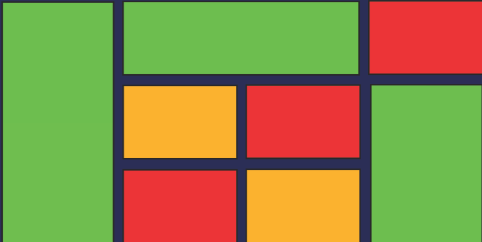

# Atividade de Fixação

### Flex

Ordene os elementos da página utilizando apenas css. A única mudança permitida no código html é de adição de classes.

### Grid

Crie divs e estilize-as utilizando os conceitos trabalhados em sala de modo que seja possível ver um grid como na imagem abaixo.

Exemplo de como o site deve parecer.

OBS: Cada retângulo deve ser uma div diferente.